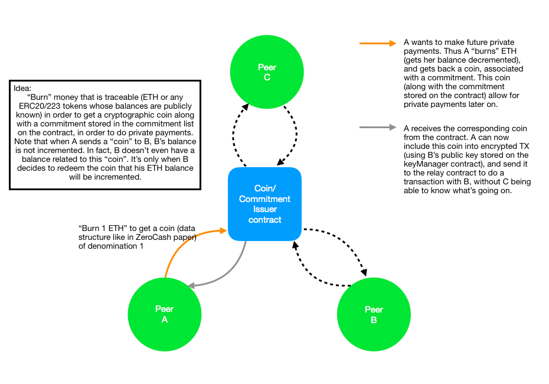

# On-chain privacy

## Design

The architecture comports 3 contracts:
- **Key manager:** keeps the public key of all peers up to date, and gives them to any one who requestthem. With these keys peers can encrypt their transactions to other peers, and only the recipient of the intended transaction can decipher his Tx by using his private key.
- **Coin issuer:** Produces coins and commitments in response of a peer "burning" his public asset. Note that, the term burning here refer to the situation where the user sends X ETH (or ERC20/ERC223 tokens) to the contract. The contract's balance is then increase by this amount, and the contract returns a coin of the same denomination. At the same time a commitment for his coin is added into a merkle tree (also managed by the contract). 
When a user wants to "exchange" the cryptographic commitment to get ETH back, he sends a request to the contract, the coin is checked to be valid (or not), and the proof that it corresponds to a commitment in the merkle tree is verified on the contract. If all checks are good, then, the contract's balance is decremented, the coin destroyed, and the user's ETH balance is incremented of the same amount.
- **Relay contract:** Is the recipient of all private transactions, and emits events containing the ciphertext of the encrypted private transaction. That way he bridges the gap between sender and recipient of a transaction. Sender and recipients never speak directly. By watching the events emitted by the relay contract, the recipient of a private Tx is the only one able to decrypt the information encrypted with his public key. Thus, he learns about the Tx he is the recipient of, by watching the events of the relay contract.

Here are some draws that illustrate the explanation above:




## Private transactions from Alice to Bob

1. Bob stores his public key on the key store of the KeyManager.sol contract. Thus every peer of the network can access it
2. Alice fetches the keys of all peers of the network, and keeps her "local keystore" up to date (by listening the different events emitted by the KeyManager)
3. If Alice wants to send 1ETH to Bob, here is what happens:
    - She "burns" (deposit) 1ETH on the CoinProvider.sol contract
    - She gets a "coin" in return. She is the only person able to redeem a ETH back from this coin because she is the only person to have the secret associated with this coin (hash pre-image for instance)
    - She encrypts the coin secret (hash pre-image) with Bob's public key (off-chain operation)
    - She calls the "Broadcast" function of the TransactionRelay.sol contract to broadcast the ciphertext of the secret to all network peers (hides the recipient of Alice's payment)
    - Bob (and all other network members), listen to the "LogTransaction" event of the "TransactionRelay" and try to decipher the message
    - All members but Bob fail to access the coin secret. Bob is now the "owner" of the coin.
    - Bob can decide to redeem 1ETH in exchange of the coin secret (his balance will thus be incremented, and an attacker can correlate Alice's balance decrease with Bob's balance increase), OR, Bob can decide to send this secret to another member C of the network as a private payment.

**Note:** The idea here is to convert part of the user's balances into some sort of "coin abstractions" which exchange does not affect the state per say. Only the exchange of the coins' secrets is settled on-chain. A user in possession of the secret at any time `t` can redeem his funds by providing the secret. This leads to the appropriate state modification (publicly visible).
While peers exchange coin secrets, their balances are not modified, and no one is able to determine the parties involved in the serie of transaction (only the coin creator, who paid to create the coin is known to be involved in a private payment, but after he sent the coin to another member, every following transactions are completely obfuscated).

## Flaws of the current (naïve) design

1. After Alice has sent the coin's secret to Bob; she still know it, and can basically redeem the 1ETH (stored on the CoinProvider contract's balance) before Bob or any further recipient on the chain of payment.
2. Any peer who has received the coin secret at least once can redeem the coin, and also, know the peer who redeems the coin at the end (and they can know when)
3. This design is **absolutely not secure** against replay attacks. If C invokes the function "claimFunds" of the CoinProvider, but the call fails; any malicious user could replay the call and steal the funds.
4. If the recipient is not listening to the LogTransaction event, then sender and recipient might need to do some off-chain communications to make sure that the transaction has been received by the recipient (and re-send it if not).

## Advantages of this design

1. The cardinality of the anonymity set is the size of the network

## TODO

1. Instead of trying to decrypt all ciphertexts that are broadcasted (which is pretty costly), we could think about something like CryptoNote's Destination Key (see: https://cryptonote.org/whitepaper.pdf page 8).
2. The ZeroCoin and ZeroCash protocols use coins and commitments along with zk-SNARKs to prevent any private information leak to the rest of the network. See how this could be applied to this model
3. Extend BabyZoE
4. Think about the lightest and simplest way to implement this coin/commitment scheme in a secure manner and with the smallest impact on performances.
5. Extend the scheme to support arbitary payments value (like in ZeroCash).

## Run the tests

1. Run:
```bash
ganache-cli
```

2. Run:
```bash
truffle test
```

## Contributing

Every contributions are welcomed. 
Please open a Pull Request for any fix/suggestion you want to submit, and open an issue if you find a flaw or have any improvements in mind.

## Resources

### zk-SNARKs

- https://media.consensys.net/introduction-to-zksnarks-with-examples-3283b554fc3b
- https://github.com/jstoxrocky/zksnarks_example
- https://github.com/zcash-hackworks/babyzoe
- https://github.com/JacobEberhardt/ZoKrates
- https://medium.com/@VitalikButerin/quadratic-arithmetic-programs-from-zero-to-hero-f6d558cea649
- http://zerocash-project.org/media/pdf/zerocash-extended-20140518.pdf

### Solidity - Truffle

- https://medium.com/@gus_tavo_guim/testing-your-smart-contracts-with-javascript-40d4edc2abed
