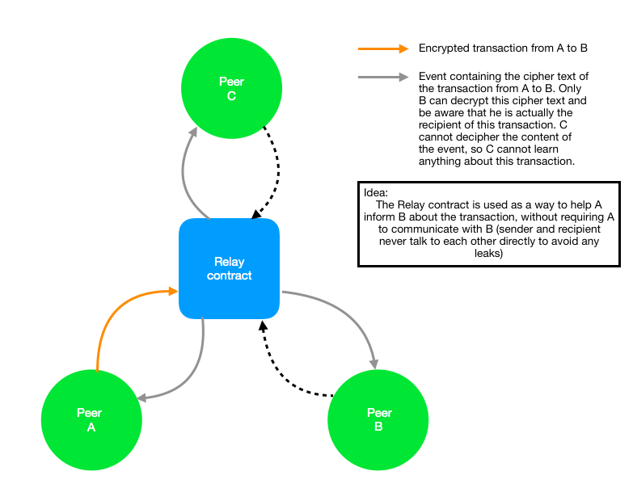
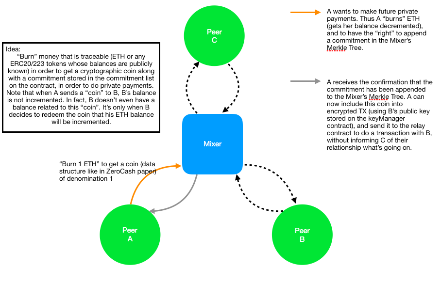

# Thinking around integrating Zerocash on Ethereum

## Smart contracts

- **AddressRegistry:** Keeps the public keys of all peers. With these keys peers can encrypt and share secrets with other peers. 
- **Mixer/MerkleTree contract:** Handles deposits of funds, and withdrawals. The Mixer contains a MerkleTree where the commitments are stored, and calls a Verifier to verify the provided proof during a withdrawal.
- **Verifier:** Contains the verification key and is in charge of verifying proofs provided by recipients during a withdrawal
- **Broadcaster (Optional):** This contract aims to be the recipient of all "private transactions". After a sender (Alice) has deposited a commitment in the Mixer, she encrypts the secret used to build the commitment with the recipient's public key (available in the KeyStore), and calls the "Broadcast" function of the Broadcaster contract. This "Brodcast" function only emits an event which field is the ciphertext sent by Alice. All nodes of the network listen to the events of the Broadcaster, and try to decrypt all payload of this event to see if they are the recipients of the transaction.

## Raw protocol

1. Both Alice and Bob generate their "private addresses" which is a tuple in the form `(Addr_pk, Addr_sk)`, where `Addr_pk = (a_pk, e_k)`, `Addr_sk = (a_sk, d_k)`, and `a_pk` is the address (public) derived from `a_sk` (private), and `e_k` is a public encryption key, and `d_k` is a decryption key (private). Here the private/public key pair `(e_k, d_k)` is used to be able to send some private data from one peer to another.
2. Both Bob and Alice publish the public part of their "private addresses" to the `AddressRegister` contract in order to be able to receive payment from other counterparts. (Note: This step is not absolutely necessary as Bob can send the public part of his address (`Addr_pk = (a_pk, e_k)`) to Alice, by using another channel of communication (offchain communications)).
3. Let Alice and Bob have all their funds on their only Ethereum account, and `v_A`, `v_B` respectively denote the amount on Ether that Alice and Bob have respectively.
    - Alice commits to the value of her balance, and to her "private address" by doing:
        - Choose a random ρ (used to derive the serial number during the spending of a coin)
        - Compute the commitment: `k <- COMM_(r_i) (a_pk_A || ρ)`, where `COMM_(r_i)` represents the commitment function using randomness `r_i`, and `a_pk_A` represents Alice's `a_pk`.
        - Compute the commitment `cm <- COMM_(s_i) (v_A || k)`, where `COMM_(r_i)` represents the commitment function using randmoness `s_i`, and `v_A` represents all the funds owned by Alice on her account.
    - The previous step results in a tuple: `c = (a_pk_A, v_A, ρ, r_i, s_i, cm)`, which Alice can use in order to generate a zk-SNARK proof that the commitment `cm` she wants to append as a leaf to the Merkle tree (held on the Merkle tree/Mixer contract) is a commitment to the value she is paying (the `deposit` function to append a commitment as a leaf of the Merkle tree is payable. This decreases Alice's balance, and increases the one of the smart contract), is the value she commited to in the commitment, and that the commitment has been computed following the "good rules".
    - Bob does the same: Creates a commitment and generates a proof.
4. Both Alice and Bob have their tuples and their proof. They now call the `deposit` function of the Merkle tree/Mixer contract in order to append their commitment as leaves of the merkle tree. The merkle tree/mixer contract verifies the proof (either call of a precompiles or another verifier contract), and appends the leaves if the verification is successful.
    - *Note1:* Anyone watching the network can see that Alice and Bob just created commitments to the values of their ethereum accounts. Thus, the previous steps didn't provide any level of obfuscation for both users.
    - *Note2:* Alice and Bob need to pay for gas in order to be able to interact with the smart contracts. Knowing this, we make, in the following points, the assumption that both Alice and Bob deposited *almost all* their Ether into the mixer contract, but kept a minimal amount of their balance in order to pay the gas for the different smart contract functions they want to execute (let's say Alice has 20 eth, she deposited 18 eth to the contract, and kept 2 eth for her to interact with the mixer in the future).
    - *Note3:* Here we assume that Alice and Bob are *NOT* the only users of the merkle tree/mixer smart contract. We make the assumption that *N* users are in fact using the mixer (ie: Size of the anonymity set = `N`). As mentioned earlier, every user depositing to the contract has to do so from a funded Ethereum address. Assuming a link between every Ethereum address and the identity of the account owner, we have an anonymity set of `N` known identities.
5. Now that Alice and Bob have their funds deposited to the mixer, they can start to transact in a "private" way.
    - Let's say Alice deposited 18 eth to the mixer, and now wants to send Bob 2 eth. Then Alice can create `m` commitments to `m` values (not necessarily different) `v_1, v_2, ..., v_m`, and can generate a proof that `∑ (i=1 to m) v_i = 18 (the value of the commitment she appended)`, and that the `m` commitments she generated are computed following the good rules. Moreover, she'll need to prove that the knows the private input `a_sk` that correspond to the `a_pk` used to compute the commitment she "spends". Finally, she can compute the serial number of the commitment she wishes to "spent/split" by deriving it from `ρ`.
    - Once Alice did that, she can append her `m` new commitments, and reveal the serial number `sn` of the one she splitted/spent, without leaking the specific commitment she just spent to anyone.
    - At that point Alice introduced some obfuscation regarding her funds, as people are not able to know whether she paid `m` persons `m` different amounts, or whether she paid `p` person (with `p < m`) and took back some change, or just whether she split her funds to herself.
    - Now Alice can use her set of commitments in order to pay Bob or any other user of the network.
6. In order for Bob to be able to actually receive a payment from Alice, he needs to have access to the value of the "coin" (the tuple `c = (a_pk_A, v_A, ρ, r_i, s_i, cm)`), in order to see whether Alice commited to the good values (ie: If Alice owed Bob 3 ETH, Bob needs to make sure that Alice really commited to 3 in the commitment she appended to the merkle tree, and that she really used the `a_pk` of Bob if the commitment generation). To do so, Alice needs to send this sensitive information to Bob, without anyone else being able to tamper/see it. A solution to this would be to use off-chain communications, and imagine a secure channel between Alice and Bob. Nevertheless, having this data recorded on-chain would be very useful (auditing, easy access to one's "private balance" via backup keys on another machine, ...). In order to do so, we can leverage the `events` emitted by smart contracts, and introduce a `broadcast/relay` contract that would hav a single function `broadcast`, that would take a ciphertext (`C = E_(e_pk)(coin information)`) and emit an event containing this cyphertext. As a consequence, users of the mixing service could just implement an `event listener` to automatically receive every `Broadcast` events, and try to decrypt it using their privqte key `d_k`. If the decryption is successful, this meants that they potentially received a payment (potentially because they still need to recompute the commitment). If the decryption fails with their key, this means that they weren't the destination of the payment (and learn nothing about who the real recipient is).
    - *Note:* This `broadcast/relay` contract is useful to make the system more usable, as people can directly receive the events and try to decrypt them. This make the system easier to automate and easier to use. Nevertheless, requiring another smart contract to handle the responsability to broadcast cyphertexts is quite annoying as the action to append a commitment representing a payment to another user and the broadcasting of the event are 2 distinct transactions that can end up in different blocks. In order to make this sequence of actions atomic, we can add the ciphertext of the coin' data as an extra argument of the function appending a commitment to the merkle tree, and emit the event at the end of this function. That way both actions happen at the same time, and the recipient gets notified of him receiving a payment as soon as the deposit transaction is mined.

## Privacy level of this system

As aformentioned (and as the title indicates), this small write-up aims to integrate the zerocash protocol on Ethereum. Nevertheless, the use of smart contracts introduce quite some changes in the amount of data that is available to an attacker.

The idea here is to convert the network users' balances into some sort of "abstractions".
In fact, as it is today, we know that a transaction where Alice sends 1ETH to Bob is going to trigger a state transition from a `state T` - where Alice's balance is `X`, and Bob's balance is `Y`-, to a `state T'` where Alice's balance is going to be `X-1`, and Bob's balance is going to be `Y+1`.
Thus, an attacker can look at the transaction object and get: `sender, receiver, amount`.

Using the design described above, however, the amount of data leaked at each transaction is 
smaller. In fact, each user's balance becomes "abstracted" by a set of commitments, that are
binding, but also hiding (you need to have some secret data to "open" the commitment).
As a consequence, every call to the mixer contract to do "private" transfers to a counterpart still leaks the sender (Alice for instance), as the sender still needs to have a funded Ethereum address to be able to pay for the gas of the smart contract call, *BUT* hides the recipient and the amount.
It is trully the ability to [Join and Split](https://github.com/zcash/zcash/blob/master/src/zcash/JoinSplit.cpp) the "commitments" that makes this design usable on Ethereum as it is today.

Of course, being able to know the identities of the set of users might not be enough in some cases. Nevertheless, this ability to combine commitments as we which means that, we are able to "break" the transaction graph. If we note the transaction graph by `G  = (V, E)`, where `V` is the set of vertices (nodes), and `E` is the set of edges (links), we go from a graph `G_before` where `V` contains all the users of the system, and `E` contains the set of transactions that correspond to their interactions; to a graph `G_after`, where `V` still contains a set of known users, but where `E` is the empty set (no interaction/link can be drawn from one user to another - assuming they all use the mixer contract obviously).

While calling the mixer contract and "spending" commitments still generates state transitions (the state transition here is basically encoded by the smart contract function we call, and modifies the merkle tree, as commitments are added, and serial numbers are revealed), *but these state transition do not reveal the same amount of information as the state transition triggered by plain Ethereum transactions.*

## Remarks

1. In some scenarios it can be hard to infer the cardinality of the anonymity set. In fact, assuming that we have this `AddressRegistry` contract that keeps the public part of the "private address" of some of the users desiring to transact privately, on-chain. We cannot be sure that the number of entries in this list gives the size of the anonymity set. In fact, Alice and Bob, can decide to do all their communications off-chain (exchange of their private addresses, and exchange of their coin secret). Thus, while Alice still needs to call the deposit function of the mixer from a funded address, Bob is the recipient of a commitment that is in the set of the leaves of the merkle tree, but does not appear on the `AddressRegistry`. Thus, only Alice knows that the cardinality of the anonymity set has `size of AddressRegistry + 1` (+ 1 corresponding to Bob) *as a lower bound*. Other users of the network still have `size of AddressRegistry` as a lower bound of the anonimity set. They are able to refine this lower bound when they see Bob calling the mixer contract function from his public address for the first time. In fact, if Bob has never registered himself to the `AddressRegistry`, and has never communicated with the mixer contract in the past; if he successfully reveals a serial number and appends a new commitment, this means that he just did a private payment via the mixer, and thus the other users can adjust their estimate of the lower bound of the cardinality of the anonymity set.
2. It should also be possible for Carol, who does not care about privacy, and thus who does not want to use to mixer, to deposit on the mixer "on-behalf" of Alice (who cares about her privacy), by creating a commitment to the value she deposits, and use Alice's address from the `AddressRegistry`. That way, Alice, sees her "private balance incremented" (she "controls" another commitment in the set of leaves of the merkle tree) wihtout needing to create it herself from her public Ethereum address. She can just decide to receive a payment either using her Ethereum address, or, *"directly in the mixer"*.

## Disclaimer

This write-up is a modest proposal to try an integrate part of the ZeroCash protocol on Ethereum.
Such projects already exists:
    - [BabyZoE](https://github.com/zcash-hackworks/babyzoe)
    - [Miximus](https://github.com/barryWhiteHat/miximus)
Although, to the best of my knowledge, none of them has done a full integration supporting the JoinSplit feature (that is very important for the privacy level).

Happy to get feedback about this, and happy to discuss it (see if I made some mistakes, see if we can refine this, have new ideas, ...)

## Illustrations

